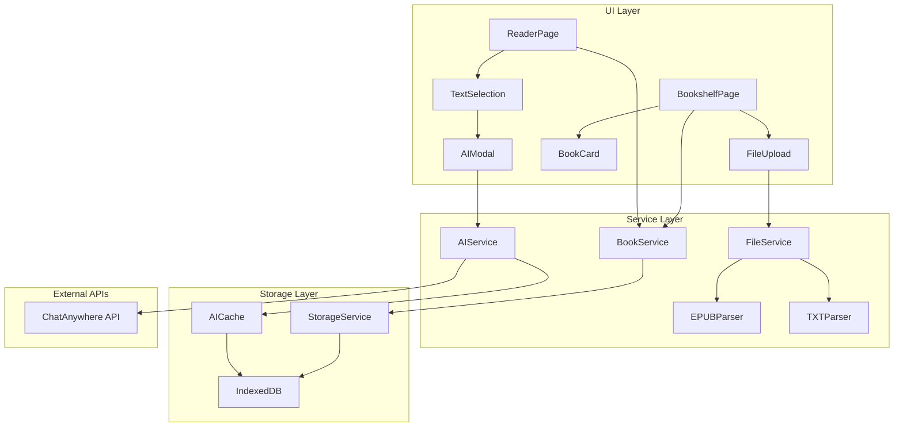
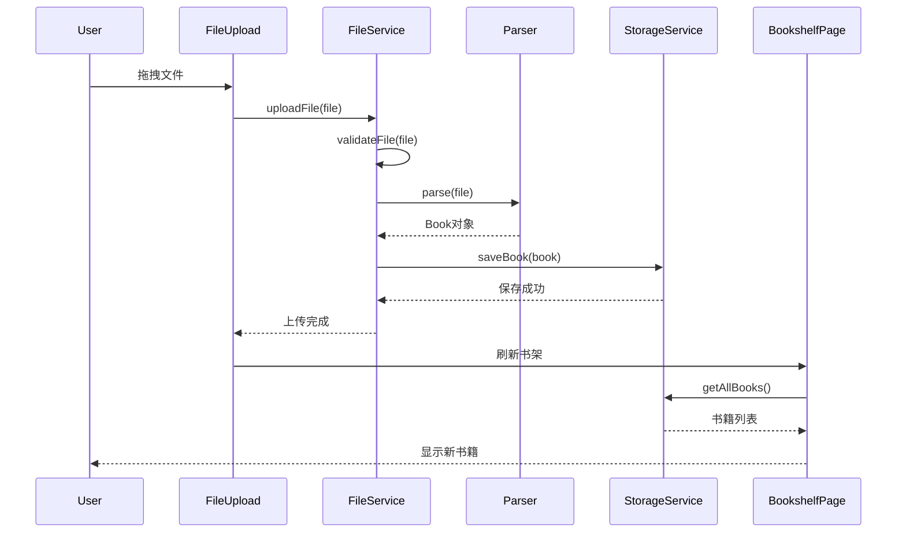
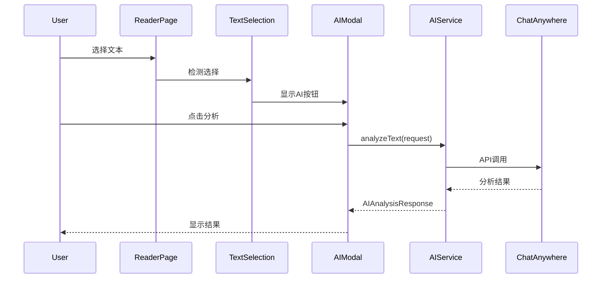

# 文件上传与AI识别功能设计文档

## 整体架构设计

### 系统架构图



### 分层设计

#### 1. UI Layer (表现层)
- **职责**: 用户交互、状态展示、事件处理
- **组件**: 页面组件、UI组件、模态框
- **特点**: 无业务逻辑、纯展示和交互

#### 2. Service Layer (服务层)
- **职责**: 业务逻辑、数据处理、API调用
- **服务**: 文件处理、AI服务、数据管理
- **特点**: 可复用、可测试、无UI依赖

#### 3. Storage Layer (存储层)
- **职责**: 数据持久化、缓存管理
- **实现**: IndexedDB封装、数据模型
- **特点**: 异步操作、错误恢复

## 核心组件设计

### 1. FileUpload 组件

#### 组件接口
```typescript
interface FileUploadProps {
  onUploadStart?: () => void;
  onUploadProgress?: (progress: number) => void;
  onUploadSuccess?: (book: Book) => void;
  onUploadError?: (error: UploadError) => void;
  className?: string;
  disabled?: boolean;
}

interface UploadError {
  code: 'FILE_TOO_LARGE' | 'INVALID_FORMAT' | 'PARSE_ERROR' | 'STORAGE_ERROR';
  message: string;
  details?: any;
}
```

#### 状态管理
```typescript
interface UploadState {
  isDragging: boolean;
  isUploading: boolean;
  progress: number;
  error: UploadError | null;
  currentFile: File | null;
}
```

#### 核心功能
- 拖拽区域高亮
- 文件格式验证
- 上传进度显示
- 错误状态处理

### 2. AIModal 组件

#### 组件接口
```typescript
interface AIModalProps {
  isOpen: boolean;
  selectedText: string;
  onClose: () => void;
  onAnalysisComplete?: (result: AIAnalysisResponse) => void;
}

interface AIModalState {
  analysisType: AIAnalysisType;
  isLoading: boolean;
  result: AIAnalysisResponse | null;
  error: string | null;
  history: AIAnalysisResponse[];
}
```

#### 功能特性
- 多种分析类型选择
- 实时加载状态
- 结果历史记录
- 复制和保存功能

### 3. TextSelection 组件

#### 组件接口
```typescript
interface TextSelectionProps {
  children: React.ReactNode;
  onTextSelect: (text: string, position: SelectionPosition) => void;
  disabled?: boolean;
}

interface SelectionPosition {
  x: number;
  y: number;
  width: number;
  height: number;
}
```

#### 实现要点
- 文本选择检测
- 选择位置计算
- AI按钮定位
- 选择状态管理

## 服务层设计

### 1. FileService

#### 服务接口
```typescript
class FileService {
  static async uploadFile(file: File, onProgress?: (progress: number) => void): Promise<Book> {
    // 文件验证
    this.validateFile(file);
    
    // 选择解析器
    const parser = this.getParser(file.type);
    
    // 解析文件
    const book = await parser.parse(file, onProgress);
    
    // 存储到数据库
    await BookService.saveBook(book);
    
    return book;
  }
  
  private static validateFile(file: File): void;
  private static getParser(mimeType: string): FileParser;
}
```

#### 文件验证规则
```typescript
interface ValidationRule {
  maxSize: number; // 50MB
  allowedTypes: string[]; // ['application/epub+zip', 'text/plain']
  allowedExtensions: string[]; // ['.epub', '.txt']
}
```

### 2. EPUBParser

#### 解析器接口
```typescript
class EPUBParser implements FileParser {
  async parse(file: File, onProgress?: (progress: number) => void): Promise<Book> {
    // 1. 解压EPUB文件
    const zip = await this.unzipFile(file);
    
    // 2. 解析OPF文件
    const metadata = await this.parseOPF(zip);
    
    // 3. 提取章节内容
    const chapters = await this.extractChapters(zip, metadata, onProgress);
    
    // 4. 构建Book对象
    return this.buildBook(metadata, chapters);
  }
  
  private async unzipFile(file: File): Promise<JSZip>;
  private async parseOPF(zip: JSZip): Promise<EPUBMetadata>;
  private async extractChapters(zip: JSZip, metadata: EPUBMetadata, onProgress?: (progress: number) => void): Promise<Chapter[]>;
  private buildBook(metadata: EPUBMetadata, chapters: Chapter[]): Book;
}
```

### 3. TXTParser

#### 解析器接口
```typescript
class TXTParser implements FileParser {
  async parse(file: File, onProgress?: (progress: number) => void): Promise<Book> {
    // 1. 检测文件编码
    const encoding = await this.detectEncoding(file);
    
    // 2. 读取文件内容
    const content = await this.readFileContent(file, encoding, onProgress);
    
    // 3. 智能分段
    const chapters = this.segmentContent(content);
    
    // 4. 构建Book对象
    return this.buildBook(file.name, chapters);
  }
  
  private async detectEncoding(file: File): Promise<string>;
  private async readFileContent(file: File, encoding: string, onProgress?: (progress: number) => void): Promise<string>;
  private segmentContent(content: string): Chapter[];
  private buildBook(filename: string, chapters: Chapter[]): Book;
}
```

### 4. AIService

#### 服务接口
```typescript
class AIService {
  static async analyzeText(request: AIAnalysisRequest): Promise<AIAnalysisResponse> {
    // 1. 检查缓存
    const cached = await this.checkCache(request);
    if (cached) return cached;
    
    // 2. 调用API
    const response = await this.callAPI(request);
    
    // 3. 缓存结果
    await this.cacheResult(request, response);
    
    return response;
  }
  
  private static async callAPI(request: AIAnalysisRequest): Promise<AIAnalysisResponse> {
    const apiKey = import.meta.env.VITE_OPENAI_API_KEY;
    const baseURL = import.meta.env.VITE_OPENAI_BASE_URL;
    const model = import.meta.env.VITE_DEFAULT_AI_MODEL;
    
    // API调用逻辑
  }
  
  private static async checkCache(request: AIAnalysisRequest): Promise<AIAnalysisResponse | null>;
  private static async cacheResult(request: AIAnalysisRequest, response: AIAnalysisResponse): Promise<void>;
}
```

### 5. StorageService

#### 数据库设计
```typescript
interface DatabaseSchema {
  books: {
    key: string; // book.id
    value: Book;
    indexes: {
      title: string;
      author: string;
      uploadDate: Date;
    };
  };
  
  aiCache: {
    key: string; // hash of request
    value: AIAnalysisResponse;
    indexes: {
      timestamp: Date;
      analysisType: string;
    };
  };
  
  readingProgress: {
    key: string; // bookId
    value: ReadPosition;
    indexes: {
      lastRead: Date;
    };
  };
}
```

#### 服务接口
```typescript
class StorageService {
  // 书籍管理
  static async saveBook(book: Book): Promise<void>;
  static async getBook(id: string): Promise<Book | null>;
  static async getAllBooks(): Promise<Book[]>;
  static async deleteBook(id: string): Promise<void>;
  
  // AI缓存管理
  static async cacheAIResult(request: AIAnalysisRequest, response: AIAnalysisResponse): Promise<void>;
  static async getCachedAIResult(request: AIAnalysisRequest): Promise<AIAnalysisResponse | null>;
  static async clearAICache(): Promise<void>;
  
  // 阅读进度管理
  static async saveReadingProgress(bookId: string, position: ReadPosition): Promise<void>;
  static async getReadingProgress(bookId: string): Promise<ReadPosition | null>;
}
```

## 数据流向图





## 异常处理策略

### 1. 文件上传异常
```typescript
enum UploadErrorCode {
  FILE_TOO_LARGE = 'FILE_TOO_LARGE',
  INVALID_FORMAT = 'INVALID_FORMAT',
  PARSE_ERROR = 'PARSE_ERROR',
  STORAGE_ERROR = 'STORAGE_ERROR',
  NETWORK_ERROR = 'NETWORK_ERROR'
}

class UploadErrorHandler {
  static handle(error: UploadErrorCode, details?: any): UploadError {
    switch (error) {
      case UploadErrorCode.FILE_TOO_LARGE:
        return {
          code: error,
          message: '文件大小超过50MB限制',
          details
        };
      case UploadErrorCode.INVALID_FORMAT:
        return {
          code: error,
          message: '不支持的文件格式，请上传EPUB或TXT文件',
          details
        };
      // ... 其他错误处理
    }
  }
}
```

### 2. AI服务异常
```typescript
class AIErrorHandler {
  static async handleAPIError(error: any): Promise<AIAnalysisResponse> {
    if (error.code === 'NETWORK_ERROR') {
      // 重试机制
      return this.retryWithBackoff(error.originalRequest);
    }
    
    if (error.code === 'RATE_LIMIT') {
      // 降级处理
      return this.fallbackResponse(error.originalRequest);
    }
    
    throw new AIServiceError(error.message, error.code);
  }
  
  private static async retryWithBackoff(request: AIAnalysisRequest, maxRetries = 3): Promise<AIAnalysisResponse>;
  private static fallbackResponse(request: AIAnalysisRequest): AIAnalysisResponse;
}
```

### 3. 存储异常
```typescript
class StorageErrorHandler {
  static async handleStorageError(error: any, operation: string): Promise<void> {
    console.error(`Storage operation failed: ${operation}`, error);
    
    if (error.name === 'QuotaExceededError') {
      // 清理旧数据
      await this.cleanupOldData();
      throw new StorageError('存储空间不足，请清理旧数据');
    }
    
    if (error.name === 'VersionError') {
      // 数据库版本冲突
      await this.migrateDatabase();
      throw new StorageError('数据库需要更新，请刷新页面');
    }
    
    throw new StorageError('存储操作失败，请重试');
  }
  
  private static async cleanupOldData(): Promise<void>;
  private static async migrateDatabase(): Promise<void>;
}
```

## 性能优化策略

### 1. 文件处理优化
- **分块读取**: 大文件分块处理，避免内存溢出
- **Web Workers**: 文件解析在Worker中进行，不阻塞UI
- **进度反馈**: 实时更新解析进度

### 2. 存储优化
- **索引优化**: 合理设计IndexedDB索引
- **批量操作**: 批量读写减少事务开销
- **数据压缩**: 大文本内容压缩存储

### 3. AI服务优化
- **请求缓存**: 相同请求返回缓存结果
- **请求合并**: 短时间内相似请求合并
- **超时控制**: 设置合理的API超时时间

---

**设计版本**: v1.0  
**创建时间**: 2025-01-14  
**设计状态**: ✅ 已完成  
**下一步**: 原子化任务拆分