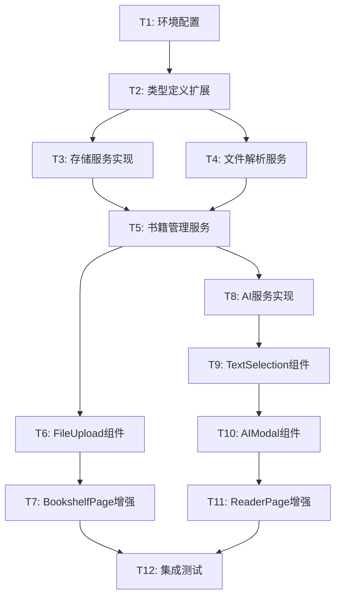

# 文件上传与AI识别功能任务拆分文档

## 任务依赖图

## 原子任务详细定义

### T1: 环境配置和依赖安装

#### 输入契约
- **前置依赖**: 现有项目结构
- **输入数据**: package.json, .env.example
- **环境依赖**: Node.js, npm

#### 输出契约
- **输出数据**: 
  - 更新的package.json（新增依赖）
  - .env文件（API配置）
  - 安装的node_modules
- **交付物**: 配置完成的开发环境
- **验收标准**: 
  - [ ] 所有依赖包成功安装
  - [ ] .env文件包含必要的API配置
  - [ ] 项目可以正常启动

#### 实现约束
- **技术栈**: npm, 环境变量
- **依赖包**: epubjs, idb, jszip, file-type
- **质量要求**: 版本兼容性检查

#### 依赖关系
- **后置任务**: T2, T3, T4
- **并行任务**: 无

---

### T2: 类型定义扩展

#### 输入契约
- **前置依赖**: T1完成
- **输入数据**: 现有types/index.ts
- **环境依赖**: TypeScript编译环境

#### 输出契约
- **输出数据**: 扩展的类型定义文件
- **交付物**: 
  - Book接口定义
  - Chapter接口定义
  - AIAnalysisRequest/Response接口
  - FileParser接口
  - 错误类型定义
- **验收标准**:
  - [ ] TypeScript编译无错误
  - [ ] 所有接口定义完整
  - [ ] 类型导出正确

#### 实现约束
- **技术栈**: TypeScript
- **接口规范**: 遵循现有命名约定
- **质量要求**: 完整的JSDoc注释

#### 依赖关系
- **前置任务**: T1
- **后置任务**: T3, T4, T5, T6, T8, T9, T10
- **并行任务**: 无

---

### T3: 存储服务实现

#### 输入契约
- **前置依赖**: T1, T2完成
- **输入数据**: 类型定义, idb库
- **环境依赖**: 支持IndexedDB的浏览器

#### 输出契约
- **输出数据**: StorageService类
- **交付物**:
  - src/services/StorageService.ts
  - 数据库初始化逻辑
  - CRUD操作方法
  - 错误处理机制
- **验收标准**:
  - [ ] 数据库创建和版本管理正常
  - [ ] 书籍数据可以增删改查
  - [ ] AI缓存功能正常
  - [ ] 阅读进度保存正常
  - [ ] 错误处理完善

#### 实现约束
- **技术栈**: IndexedDB, idb库
- **接口规范**: 异步操作，Promise返回
- **质量要求**: 完整的错误处理和事务管理

#### 依赖关系
- **前置任务**: T1, T2
- **后置任务**: T5, T8
- **并行任务**: T4

---

### T4: 文件解析服务实现

#### 输入契约
- **前置依赖**: T1, T2完成
- **输入数据**: 类型定义, epubjs, jszip库
- **环境依赖**: 现代浏览器文件API

#### 输出契约
- **输出数据**: 文件解析服务
- **交付物**:
  - src/services/FileService.ts
  - src/services/parsers/EPUBParser.ts
  - src/services/parsers/TXTParser.ts
  - src/services/parsers/FileParser.ts (接口)
- **验收标准**:
  - [ ] EPUB文件正确解析章节和元数据
  - [ ] TXT文件正确处理编码和分段
  - [ ] 文件验证功能正常
  - [ ] 解析进度回调正常
  - [ ] 错误处理完善

#### 实现约束
- **技术栈**: epubjs, jszip, File API
- **接口规范**: 统一的Parser接口
- **质量要求**: 支持大文件处理，内存优化

#### 依赖关系
- **前置任务**: T1, T2
- **后置任务**: T5, T6
- **并行任务**: T3

---

### T5: 书籍管理服务实现

#### 输入契约
- **前置依赖**: T2, T3, T4完成
- **输入数据**: 存储服务, 文件解析服务
- **环境依赖**: 完整的服务层依赖

#### 输出契约
- **输出数据**: BookService类
- **交付物**:
  - src/services/BookService.ts
  - 书籍管理逻辑
  - 阅读进度管理
  - 书籍搜索和过滤
- **验收标准**:
  - [ ] 书籍保存和检索正常
  - [ ] 阅读进度同步正常
  - [ ] 书籍删除功能正常
  - [ ] 搜索和过滤功能正常

#### 实现约束
- **技术栈**: TypeScript, 现有服务层
- **接口规范**: RESTful风格的方法命名
- **质量要求**: 完整的业务逻辑封装

#### 依赖关系
- **前置任务**: T2, T3, T4
- **后置任务**: T6, T7, T8
- **并行任务**: 无

---

### T6: FileUpload组件实现

#### 输入契约
- **前置依赖**: T2, T4, T5完成
- **输入数据**: 文件解析服务, 书籍管理服务
- **环境依赖**: React组件环境

#### 输出契约
- **输出数据**: FileUpload组件
- **交付物**:
  - src/components/upload/FileUpload.tsx
  - 拖拽上传功能
  - 进度显示组件
  - 错误处理UI
- **验收标准**:
  - [ ] 拖拽上传功能正常
  - [ ] 文件格式验证正常
  - [ ] 上传进度显示正常
  - [ ] 错误信息显示友好
  - [ ] 上传成功后回调正常

#### 实现约束
- **技术栈**: React, TypeScript, Tailwind CSS
- **接口规范**: 遵循现有组件模式
- **质量要求**: 响应式设计，无障碍访问

#### 依赖关系
- **前置任务**: T2, T4, T5
- **后置任务**: T7
- **并行任务**: T8

---

### T7: BookshelfPage增强

#### 输入契约
- **前置依赖**: T5, T6完成
- **输入数据**: 现有BookshelfPage, FileUpload组件
- **环境依赖**: React路由环境

#### 输出契约
- **输出数据**: 增强的BookshelfPage
- **交付物**:
  - 更新的src/pages/BookshelfPage.tsx
  - 书籍列表显示
  - 上传区域集成
  - 书籍操作功能
- **验收标准**:
  - [ ] 书籍列表正确显示
  - [ ] 上传功能集成正常
  - [ ] 书籍删除功能正常
  - [ ] 点击书籍可以跳转阅读
  - [ ] 空状态和加载状态正常

#### 实现约束
- **技术栈**: React, React Router, 现有UI组件
- **接口规范**: 保持现有页面结构
- **质量要求**: 用户体验优化，性能优化

#### 依赖关系
- **前置任务**: T5, T6
- **后置任务**: T12
- **并行任务**: T8, T9, T10, T11

---

### T8: AI服务实现

#### 输入契约
- **前置依赖**: T1, T2, T3, T5完成
- **输入数据**: API配置, 存储服务, 类型定义
- **环境依赖**: 网络连接, API密钥

#### 输出契约
- **输出数据**: AIService类
- **交付物**:
  - src/services/AIService.ts
  - API调用逻辑
  - 缓存机制
  - 重试和错误处理
- **验收标准**:
  - [ ] API调用功能正常
  - [ ] 多种分析类型支持
  - [ ] 缓存机制正常
  - [ ] 错误处理和重试正常
  - [ ] 超时控制正常

#### 实现约束
- **技术栈**: Fetch API, 环境变量
- **接口规范**: OpenAI API兼容
- **质量要求**: 安全性，错误恢复

#### 依赖关系
- **前置任务**: T1, T2, T3, T5
- **后置任务**: T9, T10
- **并行任务**: T6, T7

---

### T9: TextSelection组件实现

#### 输入契约
- **前置依赖**: T2, T8完成
- **输入数据**: AI服务, 类型定义
- **环境依赖**: 浏览器Selection API

#### 输出契约
- **输出数据**: TextSelection组件
- **交付物**:
  - src/components/reader/TextSelection.tsx
  - 文本选择检测
  - AI按钮定位
  - 选择状态管理
- **验收标准**:
  - [ ] 文本选择检测正常
  - [ ] AI按钮正确定位
  - [ ] 选择状态管理正常
  - [ ] 多选择区域支持
  - [ ] 移动端适配

#### 实现约束
- **技术栈**: React, Selection API, DOM操作
- **接口规范**: 高阶组件模式
- **质量要求**: 性能优化，兼容性

#### 依赖关系
- **前置任务**: T2, T8
- **后置任务**: T10, T11
- **并行任务**: T7

---

### T10: AIModal组件实现

#### 输入契约
- **前置依赖**: T2, T8, T9完成
- **输入数据**: AI服务, TextSelection组件
- **环境依赖**: React模态框环境

#### 输出契约
- **输出数据**: AIModal组件
- **交付物**:
  - src/components/ai/AIModal.tsx
  - 分析类型选择
  - 结果显示
  - 历史记录
  - 复制和保存功能
- **验收标准**:
  - [ ] 模态框显示和隐藏正常
  - [ ] 分析类型切换正常
  - [ ] 加载状态显示正常
  - [ ] 结果显示格式正确
  - [ ] 复制功能正常
  - [ ] 历史记录功能正常

#### 实现约束
- **技术栈**: React, Portal, 现有UI组件
- **接口规范**: 模态框最佳实践
- **质量要求**: 无障碍访问，键盘导航

#### 依赖关系
- **前置任务**: T2, T8, T9
- **后置任务**: T11
- **并行任务**: T7

---

### T11: ReaderPage增强

#### 输入契约
- **前置依赖**: T5, T9, T10完成
- **输入数据**: 现有ReaderPage, TextSelection, AIModal组件
- **环境依赖**: React路由参数

#### 输出契约
- **输出数据**: 增强的ReaderPage
- **交付物**:
  - 更新的src/pages/ReaderPage.tsx
  - 书籍内容显示
  - 文本选择集成
  - AI功能集成
  - 阅读进度保存
- **验收标准**:
  - [ ] 书籍内容正确显示
  - [ ] 章节导航正常
  - [ ] 文本选择功能正常
  - [ ] AI分析功能正常
  - [ ] 阅读进度自动保存
  - [ ] 响应式布局正常

#### 实现约束
- **技术栈**: React, React Router, 现有组件
- **接口规范**: 保持现有页面结构
- **质量要求**: 阅读体验优化，性能优化

#### 依赖关系
- **前置任务**: T5, T9, T10
- **后置任务**: T12
- **并行任务**: T7

---

### T12: 集成测试和优化

#### 输入契约
- **前置依赖**: T7, T11完成
- **输入数据**: 完整的功能实现
- **环境依赖**: 完整的开发环境

#### 输出契约
- **输出数据**: 测试报告和优化建议
- **交付物**:
  - 端到端测试用例
  - 性能测试报告
  - 错误处理验证
  - 用户体验优化
- **验收标准**:
  - [ ] 完整的上传→解析→阅读→AI分析流程正常
  - [ ] 所有错误场景处理正常
  - [ ] 性能指标满足要求
  - [ ] 用户体验流畅
  - [ ] 移动端适配正常

#### 实现约束
- **技术栈**: 手动测试, 浏览器开发工具
- **接口规范**: 完整的测试覆盖
- **质量要求**: 生产就绪质量

#### 依赖关系
- **前置任务**: T7, T11
- **后置任务**: 无
- **并行任务**: 无

## 任务执行计划

### 第一阶段：基础设施 (T1-T3)
- **预计时间**: 2-3小时
- **关键路径**: T1 → T2 → T3
- **风险点**: 依赖包兼容性

### 第二阶段：核心服务 (T4-T5)
- **预计时间**: 4-5小时
- **关键路径**: T4 → T5
- **风险点**: EPUB解析复杂度

### 第三阶段：UI组件 (T6-T7, T8-T10)
- **预计时间**: 5-6小时
- **并行开发**: 上传功能 + AI功能
- **风险点**: 文本选择API兼容性

### 第四阶段：页面集成 (T11)
- **预计时间**: 2-3小时
- **关键路径**: T11
- **风险点**: 组件集成复杂度

### 第五阶段：测试优化 (T12)
- **预计时间**: 2-3小时
- **关键路径**: T12
- **风险点**: 性能和兼容性问题

## 总体时间估算
- **总预计时间**: 15-20小时
- **关键路径**: T1→T2→T3→T5→T6→T7→T12
- **并行优化**: T3||T4, T6||T8, T7||T11

---

**任务版本**: v1.0  
**创建时间**: 2025-01-14  
**任务状态**: ✅ 已拆分  
**下一步**: 进入审批阶段