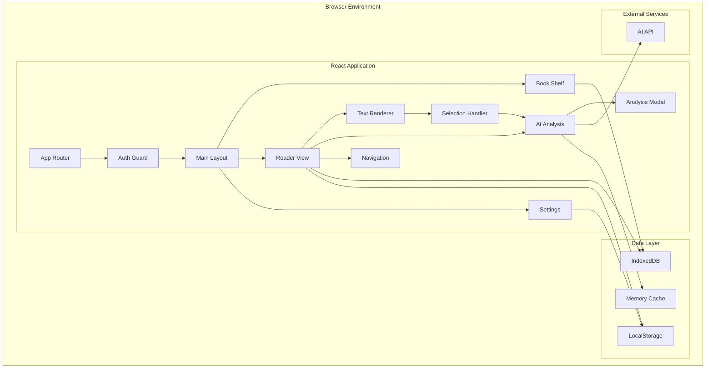
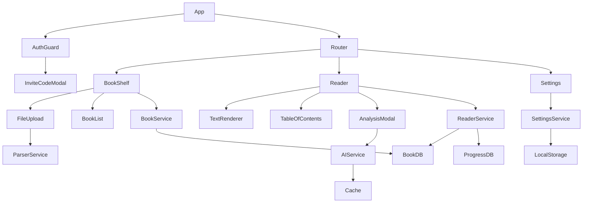
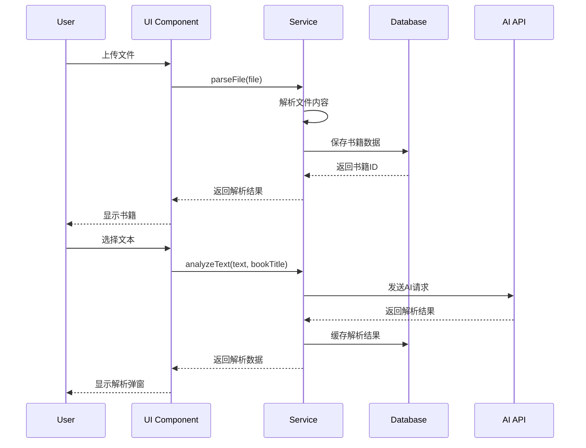

# DESIGN_Lexicon.md

## 系统架构设计

### 整体架构图



### 分层设计

#### 1. 表现层 (Presentation Layer)
```
├── components/
│   ├── common/          # 通用组件
│   │   ├── Modal/       # 毛玻璃弹窗
│   │   ├── Button/      # 按钮组件
│   │   └── Loading/     # 加载组件
│   ├── auth/            # 认证相关
│   │   └── InviteCode/  # 邀请码验证
│   ├── bookshelf/       # 书架相关
│   │   ├── BookCard/    # 书籍卡片
│   │   ├── FileUpload/  # 文件上传
│   │   └── BookList/    # 书籍列表
│   ├── reader/          # 阅读器相关
│   │   ├── TextRenderer/ # 文本渲染
│   │   ├── TableOfContents/ # 目录
│   │   ├── AnalysisModal/ # AI解析弹窗
│   │   └── ReaderControls/ # 阅读控制
│   └── settings/        # 设置相关
│       ├── FontSettings/
│       ├── ThemeSettings/
│       └── LayoutSettings/
```

#### 2. 业务逻辑层 (Business Logic Layer)
```
├── hooks/               # 自定义Hooks
│   ├── useAuth.ts       # 认证逻辑
│   ├── useBooks.ts      # 书籍管理
│   ├── useReader.ts     # 阅读器逻辑
│   ├── useAI.ts         # AI解析
│   └── useSettings.ts   # 设置管理
├── services/            # 业务服务
│   ├── bookService.ts   # 书籍服务
│   ├── aiService.ts     # AI服务
│   ├── parserService.ts # 文件解析服务
│   └── storageService.ts # 存储服务
└── utils/               # 工具函数
    ├── fileUtils.ts     # 文件处理
    ├── textUtils.ts     # 文本处理
    └── formatUtils.ts   # 格式化工具
```

#### 3. 数据访问层 (Data Access Layer)
```
├── stores/              # 状态管理
│   ├── AuthContext.tsx # 认证状态
│   ├── BookContext.tsx # 书籍状态
│   ├── ReaderContext.tsx # 阅读器状态
│   └── SettingsContext.tsx # 设置状态
├── database/            # 数据库操作
│   ├── db.ts           # IndexedDB配置
│   ├── bookDB.ts       # 书籍数据操作
│   └── progressDB.ts   # 进度数据操作
└── storage/             # 本地存储
    ├── localStorage.ts  # LocalStorage封装
    └── cache.ts        # 缓存管理
```

### 核心组件设计

#### 1. 文件解析模块
```typescript
interface FileParser {
  parse(file: File): Promise<ParsedBook>;
  validate(file: File): boolean;
  getSupportedTypes(): string[];
}

class EPUBParser implements FileParser {
  async parse(file: File): Promise<ParsedBook> {
    // 使用epub.js解析EPUB文件
  }
}

class TXTParser implements FileParser {
  async parse(file: File): Promise<ParsedBook> {
    // 解析TXT文件，生成章节
  }
}
```

#### 2. AI解析模块
```typescript
interface AIAnalyzer {
  analyze(text: string, bookTitle: string): Promise<AnalysisResult>;
  getPrompt(text: string, bookTitle: string): string;
}

class OpenAIAnalyzer implements AIAnalyzer {
  private config = {
    url: 'https://api.chatanywhere.tech/v1/chat/completions',
    apiKey: 'sk-7Qsu8LTV8OuW78S3PvMueaslzPUaOHyKEk4E2mdvcDoiwPOG',
    model: 'gpt-4o'
  };
}
```

#### 3. 数据存储模块
```typescript
// IndexedDB Schema
interface BookDB {
  books: {
    id: string;
    title: string;
    author: string;
    content: string;
    chapters: Chapter[];
    uploadDate: Date;
    fileSize: number;
  };
  
  progress: {
    bookId: string;
    currentChapter: number;
    currentPosition: number;
    lastReadTime: Date;
  };
  
  analysis: {
    id: string;
    bookId: string;
    text: string;
    result: string;
    timestamp: Date;
  };
}
```

### 模块依赖关系图



### 接口契约定义

#### 1. 书籍数据接口
```typescript
interface Book {
  id: string;
  title: string;
  author: string;
  language: string;
  chapters: Chapter[];
  metadata: BookMetadata;
  createdAt: Date;
  updatedAt: Date;
}

interface Chapter {
  id: string;
  title: string;
  content: string;
  order: number;
  wordCount: number;
}

interface BookMetadata {
  fileType: 'epub' | 'txt';
  fileSize: number;
  encoding: string;
  publisher?: string;
  publishDate?: Date;
}
```

#### 2. AI解析接口
```typescript
interface AnalysisRequest {
  text: string;
  bookTitle: string;
  context?: string;
}

interface AnalysisResult {
  basicMeaning: string;
  contextualAnalysis: string;
  idiomaticExpression: string;
  examples: string[];
  relatedPhrases: string[];
}

interface AIServiceConfig {
  url: string;
  apiKey: string;
  model: string;
  maxTokens: number;
  temperature: number;
}
```

#### 3. 阅读进度接口
```typescript
interface ReadingProgress {
  bookId: string;
  chapterId: string;
  position: number; // 字符位置
  percentage: number; // 阅读百分比
  lastReadTime: Date;
}

interface ReadingSettings {
  fontSize: number;
  fontFamily: string;
  theme: 'light' | 'sepia' | 'dark';
  lineHeight: number;
  marginSize: number;
  backgroundColor: string;
  textColor: string;
}
```

### 数据流向图



### 异常处理策略

#### 1. 文件解析异常
```typescript
class FileParseError extends Error {
  constructor(
    message: string,
    public fileType: string,
    public originalError?: Error
  ) {
    super(message);
  }
}

// 处理策略
- 显示具体错误信息
- 提供重试选项
- 建议文件格式检查
- 记录错误日志
```

#### 2. AI API异常
```typescript
class AIServiceError extends Error {
  constructor(
    message: string,
    public statusCode?: number,
    public retryable: boolean = true
  ) {
    super(message);
  }
}

// 处理策略
- 自动重试机制 (最多3次)
- 降级到缓存结果
- 显示友好错误提示
- 提供手动重试选项
```

#### 3. 存储异常
```typescript
class StorageError extends Error {
  constructor(
    message: string,
    public storageType: 'indexeddb' | 'localstorage'
  ) {
    super(message);
  }
}

// 处理策略
- 检查存储空间
- 清理过期数据
- 提示用户清理缓存
- 降级到内存存储
```

### 性能优化策略

#### 1. 文件处理优化
- 大文件分块解析
- 虚拟滚动渲染
- 懒加载章节内容
- 图片资源压缩

#### 2. AI请求优化
- 请求去重
- 结果缓存
- 请求队列管理
- 超时控制

#### 3. 渲染优化
- React.memo优化
- useMemo缓存计算
- 虚拟化长列表
- CSS动画硬件加速

### 安全考虑

#### 1. 数据安全
- 本地数据加密存储
- 敏感信息脱敏
- XSS防护
- 文件类型验证

#### 2. API安全
- 请求频率限制
- 输入内容过滤
- 错误信息脱敏
- HTTPS强制使用

## 设计验证

### 架构可行性
- ✅ 技术栈成熟稳定
- ✅ 模块职责清晰
- ✅ 接口设计合理
- ✅ 扩展性良好

### 性能可行性
- ✅ 文件解析效率可接受
- ✅ AI请求响应时间合理
- ✅ 本地存储容量充足
- ✅ 渲染性能优化到位

### 维护可行性
- ✅ 代码结构清晰
- ✅ 组件复用性高
- ✅ 错误处理完善
- ✅ 测试覆盖充分

**准备进入Atomize阶段**