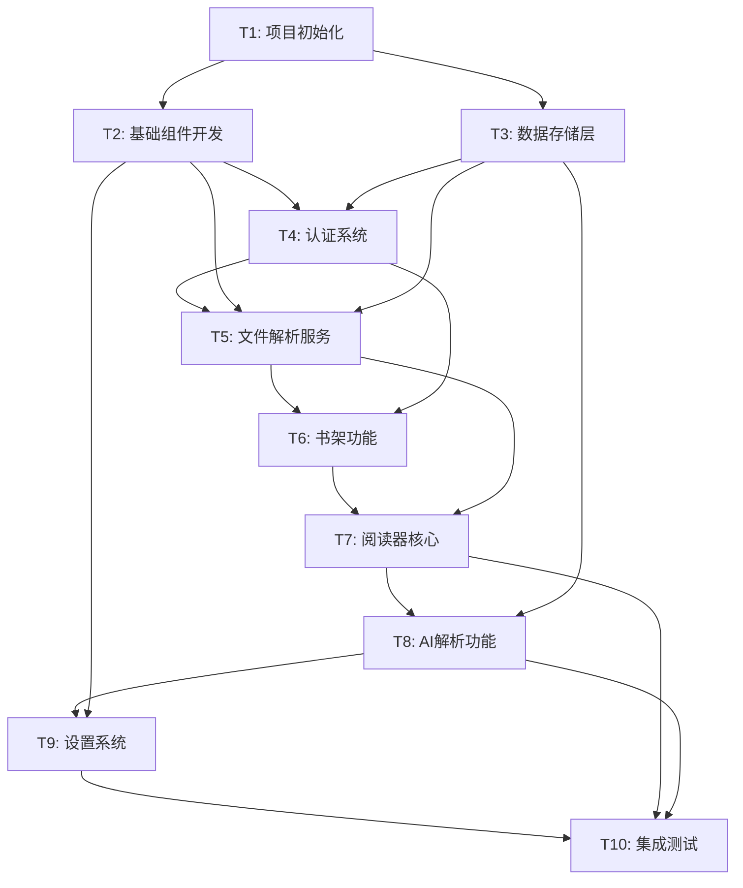

# TASK_Lexicon.md

## 原子任务拆分

### 任务依赖图

## 详细任务定义

### T1: 项目初始化

**输入契约**:
- 前置依赖: 无
- 输入数据: 项目需求文档
- 环境依赖: Node.js 18+, npm/yarn

**输出契约**:
- 输出数据: 完整的项目脚手架
- 交付物: 
  - package.json配置
  - Vite配置文件
  - TypeScript配置
  - Tailwind CSS配置
  - 基础目录结构
- 验收标准: 
  - 项目可以成功启动
  - 热重载正常工作
  - TypeScript编译无错误

**实现约束**:
- 技术栈: React 18 + TypeScript + Vite + Tailwind CSS
- 接口规范: 遵循React函数组件规范
- 质量要求: ESLint + Prettier配置

**依赖关系**:
- 后置任务: T2, T3
- 并行任务: 无

---

### T2: 基础组件开发

**输入契约**:
- 前置依赖: T1完成
- 输入数据: UI设计规范
- 环境依赖: 项目脚手架

**输出契约**:
- 输出数据: 可复用的基础组件库
- 交付物:
  - Modal组件 (毛玻璃效果)
  - Button组件
  - Loading组件
  - Layout组件
  - 主题系统
- 验收标准:
  - 所有组件可独立使用
  - 毛玻璃效果在主流浏览器正常显示
  - 组件支持主题切换

**实现约束**:
- 技术栈: React + CSS Modules + Tailwind CSS
- 接口规范: Props接口定义清晰
- 质量要求: 组件文档和示例

**依赖关系**:
- 后置任务: T4, T6, T7, T9
- 并行任务: T3

---

### T3: 数据存储层

**输入契约**:
- 前置依赖: T1完成
- 输入数据: 数据模型设计
- 环境依赖: 浏览器IndexedDB支持

**输出契约**:
- 输出数据: 完整的数据访问层
- 交付物:
  - IndexedDB数据库配置
  - 书籍数据操作接口
  - 进度数据操作接口
  - LocalStorage封装
  - 缓存管理系统
- 验收标准:
  - 数据CRUD操作正常
  - 数据持久化验证
  - 错误处理完善

**实现约束**:
- 技术栈: Dexie.js + TypeScript
- 接口规范: Promise-based异步接口
- 质量要求: 完整的错误处理

**依赖关系**:
- 后置任务: T4, T5, T6, T8
- 并行任务: T2

---

### T4: 认证系统

**输入契约**:
- 前置依赖: T2, T3完成
- 输入数据: 邀请码验证规则
- 环境依赖: 基础组件和存储层

**输出契约**:
- 输出数据: 认证状态管理
- 交付物:
  - 邀请码验证组件
  - 认证状态Context
  - 路由守卫
  - 认证持久化
- 验收标准:
  - 邀请码"welcome"验证正常
  - 认证状态持久化
  - 未认证用户无法访问主功能

**实现约束**:
- 技术栈: React Context + LocalStorage
- 接口规范: 统一的认证接口
- 质量要求: 安全的状态管理

**依赖关系**:
- 后置任务: T5, T6
- 并行任务: 无

---

### T5: 文件解析服务

**输入契约**:
- 前置依赖: T4完成, T2, T3完成
- 输入数据: 支持的文件格式规范
- 环境依赖: epub.js库

**输出契约**:
- 输出数据: 文件解析结果
- 交付物:
  - EPUB解析器
  - TXT解析器
  - 文件验证器
  - 解析服务接口
  - 错误处理机制
- 验收标准:
  - EPUB文件解析成功率>95%
  - TXT文件正确分章
  - 解析时间<5秒(10MB内)

**实现约束**:
- 技术栈: epub.js + 原生JavaScript
- 接口规范: 统一的解析器接口
- 质量要求: 完善的错误处理和进度提示

**依赖关系**:
- 后置任务: T6, T7
- 并行任务: 无

---

### T6: 书架功能

**输入契约**:
- 前置依赖: T4, T5完成
- 输入数据: 书籍管理需求
- 环境依赖: 文件解析服务和认证系统

**输出契约**:
- 输出数据: 书籍管理界面
- 交付物:
  - 文件上传组件
  - 书籍列表组件
  - 书籍卡片组件
  - 书籍删除功能
  - 搜索过滤功能
- 验收标准:
  - 支持拖拽上传
  - 书籍信息正确显示
  - 删除操作安全确认

**实现约束**:
- 技术栈: React + 文件API
- 接口规范: 统一的书籍管理接口
- 质量要求: 用户友好的交互体验

**依赖关系**:
- 后置任务: T7
- 并行任务: 无

---

### T7: 阅读器核心

**输入契约**:
- 前置依赖: T5, T6完成
- 输入数据: 解析后的书籍数据
- 环境依赖: 书架功能和文件解析服务

**输出契约**:
- 输出数据: 完整的阅读界面
- 交付物:
  - 文本渲染组件
  - 目录导航组件
  - 阅读进度管理
  - 文本选择处理
  - 阅读设置面板
- 验收标准:
  - 文本渲染正确
  - 目录导航准确
  - 进度保存可靠

**实现约束**:
- 技术栈: React + CSS
- 接口规范: 阅读器状态管理接口
- 质量要求: 流畅的阅读体验

**依赖关系**:
- 后置任务: T8, T10
- 并行任务: 无

---

### T8: AI解析功能

**输入契约**:
- 前置依赖: T7完成, T3完成
- 输入数据: 选中的文本内容
- 环境依赖: AI API配置和缓存系统

**输出契约**:
- 输出数据: AI解析结果
- 交付物:
  - AI服务接口
  - 解析结果弹窗
  - 缓存管理
  - 请求队列管理
  - 错误重试机制
- 验收标准:
  - AI解析成功率>90%
  - 响应时间<10秒
  - 结果缓存有效

**实现约束**:
- 技术栈: Fetch API + React
- 接口规范: OpenAI兼容接口
- 质量要求: 稳定的API调用和错误处理

**依赖关系**:
- 后置任务: T10
- 并行任务: T9

---

### T9: 设置系统

**输入契约**:
- 前置依赖: T2完成
- 输入数据: 用户设置需求
- 环境依赖: 基础组件库

**输出契约**:
- 输出数据: 个性化设置界面
- 交付物:
  - 字体设置组件
  - 主题设置组件
  - 布局设置组件
  - 设置持久化
  - 设置导入导出
- 验收标准:
  - 设置即时生效
  - 设置持久化保存
  - 重置功能正常

**实现约束**:
- 技术栈: React + LocalStorage
- 接口规范: 设置管理接口
- 质量要求: 直观的设置界面

**依赖关系**:
- 后置任务: T10
- 并行任务: T8

---

### T10: 集成测试

**输入契约**:
- 前置依赖: T7, T8, T9完成
- 输入数据: 完整的应用功能
- 环境依赖: 所有功能模块

**输出契约**:
- 输出数据: 测试报告和部署包
- 交付物:
  - 功能测试用例
  - 性能测试报告
  - 兼容性测试报告
  - 生产构建包
  - 部署文档
- 验收标准:
  - 所有核心功能正常
  - 性能指标达标
  - 主流浏览器兼容

**实现约束**:
- 技术栈: Jest + Testing Library
- 接口规范: 测试覆盖率>80%
- 质量要求: 完整的测试文档

**依赖关系**:
- 后置任务: 无
- 并行任务: 无

## 任务执行计划

### 第一阶段: 基础设施 (1-2天)
- T1: 项目初始化 (4小时)
- T2: 基础组件开发 (8小时)
- T3: 数据存储层 (6小时)

### 第二阶段: 核心功能 (2-3天)
- T4: 认证系统 (3小时)
- T5: 文件解析服务 (8小时)
- T6: 书架功能 (6小时)

### 第三阶段: 阅读体验 (2-3天)
- T7: 阅读器核心 (10小时)
- T8: AI解析功能 (8小时)
- T9: 设置系统 (4小时)

### 第四阶段: 测试部署 (1天)
- T10: 集成测试 (6小时)

## 风险评估

### 高风险任务
1. **T5: 文件解析服务**
   - 风险: EPUB格式复杂性
   - 缓解: 使用成熟的epub.js库
   
2. **T8: AI解析功能**
   - 风险: API稳定性和响应时间
   - 缓解: 实现重试机制和缓存

### 中风险任务
1. **T7: 阅读器核心**
   - 风险: 性能优化复杂
   - 缓解: 分步实现，逐步优化

2. **T2: 基础组件开发**
   - 风险: 毛玻璃效果兼容性
   - 缓解: 提供降级方案

## 质量保证

### 代码质量
- TypeScript严格模式
- ESLint + Prettier
- 组件单元测试
- 代码审查

### 功能质量
- 每个任务独立验收
- 集成测试覆盖
- 用户体验测试
- 性能基准测试

### 交付质量
- 完整的文档
- 部署指南
- 问题排查手册
- 用户使用指南

**准备进入Approve阶段**