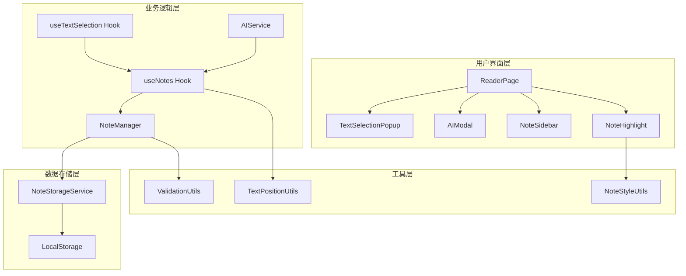
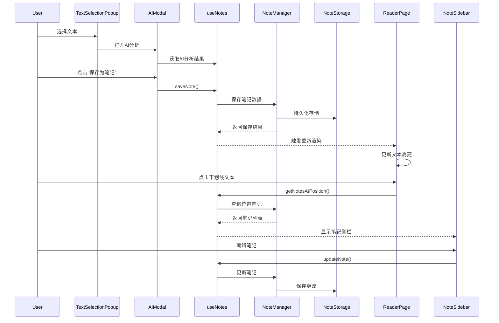
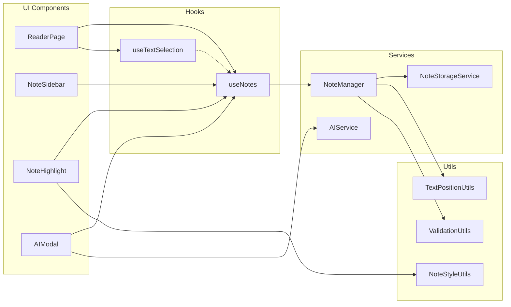

# 笔记功能架构设计文档

## 整体架构图



## 核心组件设计

### 1. NoteSidebar 组件

```typescript
interface NoteSidebarProps {
  isVisible: boolean;
  notes: Note[];
  onClose: () => void;
  onEdit: (noteId: string, content: string) => void;
  onDelete: (noteId: string) => void;
}

const NoteSidebar: React.FC<NoteSidebarProps> = ({
  isVisible,
  notes,
  onClose,
  onEdit,
  onDelete
}) => {
  // 侧栏实现
};
```

**功能特性:**
- 右侧滑入/滑出动画
- 支持多个笔记的展示
- 内联编辑功能
- 删除确认对话框
- 按分析类型分组显示

### 2. NoteHighlight 组件

```typescript
interface NoteHighlightProps {
  text: string;
  notes: Note[];
  onNoteClick: (notes: Note[]) => void;
}

const NoteHighlight: React.FC<NoteHighlightProps> = ({
  text,
  notes,
  onNoteClick
}) => {
  // 文本高亮渲染
};
```

**功能特性:**
- 智能文本分割和高亮
- 多层下划线样式叠加
- 点击事件处理
- 悬停提示效果

### 3. useNotes Hook

```typescript
interface UseNotesReturn {
  notes: Note[];
  saveNote: (note: Omit<Note, 'id' | 'createdAt' | 'updatedAt'>) => void;
  updateNote: (id: string, updates: Partial<Note>) => void;
  deleteNote: (id: string) => void;
  getNotesAtPosition: (documentId: string, offset: number) => Note[];
  isLoading: boolean;
  error: string | null;
}

const useNotes = (): UseNotesReturn => {
  // Hook实现
};
```

**功能特性:**
- 笔记CRUD操作
- 位置查询优化
- 错误处理
- 加载状态管理

### 4. NoteManager 服务

```typescript
class NoteManager {
  private storage: NoteStorageService;
  private positionUtils: TextPositionUtils;
  
  constructor() {
    this.storage = new NoteStorageService();
    this.positionUtils = new TextPositionUtils();
  }
  
  async saveNote(note: Omit<Note, 'id' | 'createdAt' | 'updatedAt'>): Promise<Note>;
  async updateNote(id: string, updates: Partial<Note>): Promise<Note>;
  async deleteNote(id: string): Promise<void>;
  async getNotesForDocument(documentId: string): Promise<Note[]>;
  async getNotesAtPosition(documentId: string, offset: number): Promise<Note[]>;
}
```

## 数据流向图



## 模块依赖关系图



## 接口契约定义

### 1. Note 数据接口

```typescript
interface Note {
  id: string;
  type: 'vocabulary' | 'grammar' | 'cultural' | 'semantic';
  originalText: string;
  analysis: string;
  position: TextPosition;
  createdAt: Date;
  updatedAt: Date;
}

interface TextPosition {
  startOffset: number;
  endOffset: number;
  documentId: string;
  contextBefore: string; // 前后文用于位置验证
  contextAfter: string;
}
```

### 2. NoteStorage 接口

```typescript
interface INoteStorage {
  save(notes: Note[]): Promise<void>;
  load(): Promise<Note[]>;
  clear(): Promise<void>;
  export(): Promise<string>;
  import(data: string): Promise<void>;
}
```

### 3. TextPosition 工具接口

```typescript
interface ITextPositionUtils {
  calculatePosition(element: Element, selection: Selection): TextPosition;
  findTextByPosition(position: TextPosition): Range | null;
  validatePosition(position: TextPosition): boolean;
  updatePosition(position: TextPosition, textChange: TextChange): TextPosition;
}
```

## 样式系统设计

### 1. 下划线样式定义

```css
/* 词汇分析 - 虚线下划线 */
.note-highlight-vocabulary {
  border-bottom: 2px dashed #3b82f6;
  cursor: pointer;
  transition: all 0.2s ease;
}

.note-highlight-vocabulary:hover {
  background-color: rgba(59, 130, 246, 0.1);
}

/* 语法分析 - 实线下划线 */
.note-highlight-grammar {
  border-bottom: 2px solid #10b981;
  cursor: pointer;
  transition: all 0.2s ease;
}

.note-highlight-grammar:hover {
  background-color: rgba(16, 185, 129, 0.1);
}

/* 文化背景分析 - 波浪线 */
.note-highlight-cultural {
  text-decoration: underline wavy #f59e0b;
  text-decoration-thickness: 2px;
  cursor: pointer;
  transition: all 0.2s ease;
}

.note-highlight-cultural:hover {
  background-color: rgba(245, 158, 11, 0.1);
}

/* 语义分析 - 双下划线 */
.note-highlight-semantic {
  border-bottom: 3px double #ef4444;
  cursor: pointer;
  transition: all 0.2s ease;
}

.note-highlight-semantic:hover {
  background-color: rgba(239, 68, 68, 0.1);
}

/* 多重样式叠加 */
.note-highlight-multiple {
  position: relative;
}

.note-highlight-multiple::after {
  content: '';
  position: absolute;
  bottom: -1px;
  left: 0;
  right: 0;
  height: 1px;
  background: linear-gradient(90deg, #3b82f6, #10b981, #f59e0b, #ef4444);
}
```

### 2. 侧栏样式设计

```css
.note-sidebar {
  position: fixed;
  top: 0;
  right: 0;
  width: 400px;
  height: 100vh;
  background: white;
  box-shadow: -4px 0 20px rgba(0, 0, 0, 0.1);
  transform: translateX(100%);
  transition: transform 0.3s ease;
  z-index: 1000;
}

.note-sidebar.visible {
  transform: translateX(0);
}

.note-sidebar-overlay {
  position: fixed;
  top: 0;
  left: 0;
  right: 0;
  bottom: 0;
  background: rgba(0, 0, 0, 0.3);
  z-index: 999;
  opacity: 0;
  transition: opacity 0.3s ease;
}

.note-sidebar-overlay.visible {
  opacity: 1;
}
```

## 异常处理策略

### 1. 数据异常处理

```typescript
class NoteErrorHandler {
  static handleStorageError(error: Error): void {
    console.error('笔记存储错误:', error);
    // 降级到内存存储
    // 显示用户友好的错误信息
  }
  
  static handlePositionError(error: Error): void {
    console.error('文本位置错误:', error);
    // 尝试重新定位
    // 标记为无效笔记
  }
  
  static handleRenderError(error: Error): void {
    console.error('渲染错误:', error);
    // 跳过有问题的笔记
    // 继续渲染其他笔记
  }
}
```

### 2. 用户体验异常处理

- **网络异常**: 纯本地功能，无网络依赖
- **存储异常**: 降级到内存存储，提示用户
- **位置异常**: 智能重定位，标记无效笔记
- **渲染异常**: 错误边界组件，优雅降级

## 性能优化设计

### 1. 渲染优化

```typescript
// 虚拟滚动实现
const VirtualizedNoteList: React.FC<{notes: Note[]}> = ({notes}) => {
  const [visibleRange, setVisibleRange] = useState({start: 0, end: 10});
  
  // 只渲染可见范围内的笔记
  const visibleNotes = notes.slice(visibleRange.start, visibleRange.end);
  
  return (
    <div className="note-list-container">
      {visibleNotes.map(note => (
        <NoteItem key={note.id} note={note} />
      ))}
    </div>
  );
};
```

### 2. 存储优化

```typescript
// 增量更新策略
class OptimizedNoteStorage {
  private cache = new Map<string, Note>();
  private dirtyNotes = new Set<string>();
  
  async batchSave(): Promise<void> {
    const notesToSave = Array.from(this.dirtyNotes)
      .map(id => this.cache.get(id))
      .filter(Boolean);
    
    await this.storage.saveBatch(notesToSave);
    this.dirtyNotes.clear();
  }
}
```

### 3. 查询优化

```typescript
// 位置索引优化
class PositionIndex {
  private index = new Map<string, Note[]>();
  
  buildIndex(notes: Note[]): void {
    this.index.clear();
    notes.forEach(note => {
      const key = `${note.position.documentId}:${note.position.startOffset}`;
      if (!this.index.has(key)) {
        this.index.set(key, []);
      }
      this.index.get(key)!.push(note);
    });
  }
  
  findByPosition(documentId: string, offset: number): Note[] {
    const key = `${documentId}:${offset}`;
    return this.index.get(key) || [];
  }
}
```

## 集成点设计

### 1. 与现有AI分析流程集成

```typescript
// 在AIModal中添加保存按钮
const AIModal: React.FC<AIModalProps> = (props) => {
  const { saveNote } = useNotes();
  
  const handleSaveNote = () => {
    const note = {
      type: props.analysisType,
      originalText: props.selectedText,
      analysis: props.analysisResult,
      position: props.textPosition
    };
    saveNote(note);
  };
  
  return (
    <div className="ai-modal">
      {/* 现有内容 */}
      <button onClick={handleSaveNote} className="save-note-btn">
        保存为笔记
      </button>
    </div>
  );
};
```

### 2. 与文本选择系统集成

```typescript
// 在ReaderPage中集成笔记高亮
const ReaderPage: React.FC = () => {
  const { notes, getNotesAtPosition } = useNotes();
  const [selectedNotes, setSelectedNotes] = useState<Note[]>([]);
  const [sidebarVisible, setSidebarVisible] = useState(false);
  
  const handleTextClick = (position: TextPosition) => {
    const notesAtPosition = getNotesAtPosition(
      position.documentId, 
      position.startOffset
    );
    
    if (notesAtPosition.length > 0) {
      setSelectedNotes(notesAtPosition);
      setSidebarVisible(true);
    }
  };
  
  return (
    <div className="reader-page">
      <NoteHighlight 
        text={documentText} 
        notes={notes}
        onNoteClick={handleTextClick}
      />
      <NoteSidebar 
        isVisible={sidebarVisible}
        notes={selectedNotes}
        onClose={() => setSidebarVisible(false)}
      />
    </div>
  );
};
```

## 测试策略

### 1. 单元测试
- NoteManager 服务测试
- TextPositionUtils 工具测试
- useNotes Hook 测试

### 2. 集成测试
- 完整的保存-查看流程测试
- 多种分析类型叠加测试
- 侧栏交互测试

### 3. 性能测试
- 大量笔记渲染性能测试
- 存储操作性能测试
- 内存使用测试

这个设计文档为笔记功能的实现提供了完整的技术蓝图，确保所有组件和服务能够协调工作，同时保持与现有系统的良好集成。