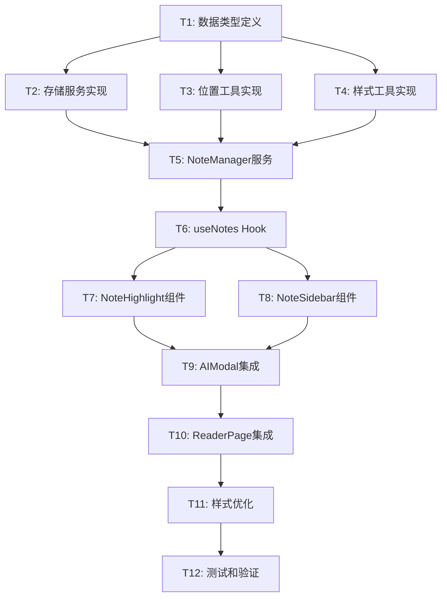

# 笔记功能任务拆分文档

## 任务依赖关系图

## 原子任务详细定义

### T1: 数据类型定义

**任务描述**: 定义笔记功能相关的TypeScript类型和接口

**输入契约**:
- 前置依赖: 无
- 输入数据: 设计文档中的数据结构规范
- 环境依赖: TypeScript开发环境

**输出契约**:
- 输出数据: 完整的类型定义文件
- 交付物: `src/types/notes.ts`
- 验收标准: 
  - 所有接口定义完整
  - 类型导出正确
  - 无TypeScript编译错误

**实现约束**:
- 技术栈: TypeScript
- 接口规范: 遵循现有项目的类型定义规范
- 质量要求: 完整的JSDoc注释

**依赖关系**: 无前置任务，为后续所有任务的基础

---

### T2: 存储服务实现

**任务描述**: 实现笔记数据的本地存储服务

**输入契约**:
- 前置依赖: T1完成
- 输入数据: Note类型定义
- 环境依赖: 浏览器localStorage API

**输出契约**:
- 输出数据: NoteStorageService类
- 交付物: `src/lib/services/note-storage.ts`
- 验收标准:
  - 支持CRUD操作
  - 数据序列化/反序列化正确
  - 错误处理完善
  - 支持数据导入导出

**实现约束**:
- 技术栈: TypeScript + localStorage
- 接口规范: 实现INoteStorage接口
- 质量要求: 完整的错误处理和日志

**依赖关系**: 依赖T1，为T5提供基础

---

### T3: 位置工具实现

**任务描述**: 实现文本位置计算和验证工具

**输入契约**:
- 前置依赖: T1完成
- 输入数据: TextPosition类型定义
- 环境依赖: DOM API

**输出契约**:
- 输出数据: TextPositionUtils类
- 交付物: `src/lib/utils/text-position.ts`
- 验收标准:
  - 准确计算文本位置
  - 支持位置验证
  - 处理动态内容变化
  - 性能优化

**实现约束**:
- 技术栈: TypeScript + DOM API
- 接口规范: 实现ITextPositionUtils接口
- 质量要求: 高精度位置计算，边界情况处理

**依赖关系**: 依赖T1，为T5提供基础

---

### T4: 样式工具实现

**任务描述**: 实现笔记高亮样式管理工具

**输入契约**:
- 前置依赖: T1完成
- 输入数据: Note类型定义
- 环境依赖: CSS-in-JS或Tailwind CSS

**输出契约**:
- 输出数据: NoteStyleUtils类和CSS样式
- 交付物: `src/lib/utils/note-styles.ts` 和样式文件
- 验收标准:
  - 四种下划线样式正确实现
  - 支持样式叠加
  - 悬停效果流畅
  - 响应式设计

**实现约束**:
- 技术栈: TypeScript + Tailwind CSS
- 接口规范: 遵循设计文档的样式规范
- 质量要求: 视觉效果美观，性能优化

**依赖关系**: 依赖T1，为T7提供基础

---

### T5: NoteManager服务

**任务描述**: 实现笔记管理核心业务逻辑

**输入契约**:
- 前置依赖: T1, T2, T3完成
- 输入数据: 存储服务和位置工具
- 环境依赖: 前述服务正常工作

**输出契约**:
- 输出数据: NoteManager类
- 交付物: `src/lib/services/note-manager.ts`
- 验收标准:
  - 完整的笔记CRUD操作
  - 位置查询优化
  - 数据一致性保证
  - 错误处理和恢复

**实现约束**:
- 技术栈: TypeScript
- 接口规范: 实现设计文档中的NoteManager接口
- 质量要求: 高可靠性，性能优化

**依赖关系**: 依赖T1-T3，为T6提供基础

---

### T6: useNotes Hook

**任务描述**: 实现React Hook封装笔记管理逻辑

**输入契约**:
- 前置依赖: T5完成
- 输入数据: NoteManager服务
- 环境依赖: React Hooks API

**输出契约**:
- 输出数据: useNotes Hook
- 交付物: `src/hooks/useNotes.ts`
- 验收标准:
  - React状态管理正确
  - 异步操作处理
  - 错误状态管理
  - 性能优化（useMemo, useCallback）

**实现约束**:
- 技术栈: React + TypeScript
- 接口规范: 实现UseNotesReturn接口
- 质量要求: 遵循React Hooks最佳实践

**依赖关系**: 依赖T5，为T7-T8提供基础

---

### T7: NoteHighlight组件

**任务描述**: 实现文本高亮显示组件

**输入契约**:
- 前置依赖: T4, T6完成
- 输入数据: 样式工具和useNotes Hook
- 环境依赖: React组件环境

**输出契约**:
- 输出数据: NoteHighlight React组件
- 交付物: `src/components/ui/NoteHighlight.tsx`
- 验收标准:
  - 正确渲染下划线样式
  - 支持多重样式叠加
  - 点击事件处理正确
  - 性能优化（大文本处理）

**实现约束**:
- 技术栈: React + TypeScript + Tailwind CSS
- 接口规范: 实现NoteHighlightProps接口
- 质量要求: 高性能渲染，用户体验流畅

**依赖关系**: 依赖T4, T6，为T9提供基础

---

### T8: NoteSidebar组件

**任务描述**: 实现右侧笔记侧栏组件

**输入契约**:
- 前置依赖: T6完成
- 输入数据: useNotes Hook
- 环境依赖: React组件环境

**输出契约**:
- 输出数据: NoteSidebar React组件
- 交付物: `src/components/ui/NoteSidebar.tsx`
- 验收标准:
  - 滑入滑出动画流畅
  - 笔记列表正确显示
  - 编辑功能正常工作
  - 删除确认机制

**实现约束**:
- 技术栈: React + TypeScript + Tailwind CSS
- 接口规范: 实现NoteSidebarProps接口
- 质量要求: 用户体验优秀，响应式设计

**依赖关系**: 依赖T6，为T9提供基础

---

### T9: AIModal集成

**任务描述**: 在现有AIModal中集成保存笔记功能

**输入契约**:
- 前置依赖: T6, T7, T8完成
- 输入数据: 现有AIModal组件和笔记相关组件
- 环境依赖: 现有AI分析流程

**输出契约**:
- 输出数据: 更新的AIModal组件
- 交付物: 修改`src/components/ui/AIModal.tsx`
- 验收标准:
  - "保存为笔记"按钮正确显示
  - 保存功能正常工作
  - 不影响现有AI分析流程
  - UI集成自然

**实现约束**:
- 技术栈: 保持现有技术栈
- 接口规范: 保持现有接口兼容
- 质量要求: 无破坏性变更，向后兼容

**依赖关系**: 依赖T6-T8，为T10提供基础

---

### T10: ReaderPage集成

**任务描述**: 在ReaderPage中集成完整的笔记功能

**输入契约**:
- 前置依赖: T9完成
- 输入数据: 所有笔记相关组件
- 环境依赖: 现有ReaderPage组件

**输出契约**:
- 输出数据: 更新的ReaderPage组件
- 交付物: 修改`src/pages/ReaderPage.tsx`
- 验收标准:
  - 文本高亮正确显示
  - 侧栏交互正常
  - 与现有功能无冲突
  - 整体用户体验流畅

**实现约束**:
- 技术栈: 保持现有技术栈
- 接口规范: 保持现有接口兼容
- 质量要求: 性能不受影响，功能完整

**依赖关系**: 依赖T9，为T11提供基础

---

### T11: 样式优化

**任务描述**: 优化整体样式和用户体验

**输入契约**:
- 前置依赖: T10完成
- 输入数据: 完整的功能实现
- 环境依赖: 浏览器测试环境

**输出契约**:
- 输出数据: 优化的样式文件
- 交付物: 更新的CSS/样式文件
- 验收标准:
  - 视觉效果美观
  - 动画流畅
  - 响应式设计完善
  - 无样式冲突

**实现约束**:
- 技术栈: Tailwind CSS
- 接口规范: 遵循设计系统
- 质量要求: 高质量视觉体验

**依赖关系**: 依赖T10，为T12提供基础

---

### T12: 测试和验证

**任务描述**: 完整的功能测试和性能验证

**输入契约**:
- 前置依赖: T11完成
- 输入数据: 完整的功能实现
- 环境依赖: 测试环境

**输出契约**:
- 输出数据: 测试报告和修复
- 交付物: 测试文件和文档更新
- 验收标准:
  - 所有功能正常工作
  - 性能指标达标
  - 无明显bug
  - 用户体验良好

**实现约束**:
- 技术栈: Jest + React Testing Library
- 接口规范: 遵循测试最佳实践
- 质量要求: 高测试覆盖率

**依赖关系**: 依赖T11，项目完成

## 任务优先级

### 高优先级 (必须完成)
- T1: 数据类型定义
- T2: 存储服务实现
- T5: NoteManager服务
- T6: useNotes Hook
- T9: AIModal集成
- T10: ReaderPage集成

### 中优先级 (重要功能)
- T3: 位置工具实现
- T7: NoteHighlight组件
- T8: NoteSidebar组件

### 低优先级 (优化功能)
- T4: 样式工具实现
- T11: 样式优化
- T12: 测试和验证

## 风险评估

### 高风险任务
- **T3: 位置工具实现** - 文本位置计算复杂，可能影响准确性
- **T7: NoteHighlight组件** - 大文本渲染性能，样式叠加复杂

### 中风险任务
- **T10: ReaderPage集成** - 与现有功能集成，可能产生冲突
- **T5: NoteManager服务** - 数据一致性和性能要求高

### 低风险任务
- **T1, T2, T4, T6, T8, T9, T11, T12** - 相对独立，风险可控

## 预估工作量

| 任务 | 预估时间 | 复杂度 |
|------|----------|--------|
| T1 | 2小时 | 低 |
| T2 | 4小时 | 中 |
| T3 | 6小时 | 高 |
| T4 | 3小时 | 中 |
| T5 | 5小时 | 高 |
| T6 | 3小时 | 中 |
| T7 | 6小时 | 高 |
| T8 | 4小时 | 中 |
| T9 | 2小时 | 低 |
| T10 | 3小时 | 中 |
| T11 | 2小时 | 低 |
| T12 | 4小时 | 中 |

**总计**: 44小时，约5-6个工作日

## 质量保证

每个任务完成后需要进行：
1. **代码审查**: 检查代码质量和规范
2. **功能测试**: 验证功能正确性
3. **集成测试**: 确保与现有系统兼容
4. **性能测试**: 验证性能指标
5. **文档更新**: 同步更新相关文档

这个任务拆分确保了每个任务都是原子性的、可独立验证的，并且有清晰的依赖关系，便于按顺序实施。